# __PHẦN MỀM QUẢN LÝ KINH DOANH KARAOKE RUM__
## __1. Giới thiệu:__
### __1.1 Giới thiệu thành viên__
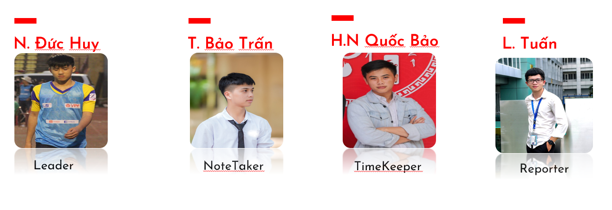

### __1.2 Đặt vấn đề__

> Hiện nay, công nghệ thông tin đang đóng vai trò quan trọng trong quá trình quản trị, điều hành các hoạt động sản xuất kinh doanh của mỗi doanh nghiệp. Hiểu được lợi ích mà công nghệ mang lại và để tận dụng điều đó, chủ sở hữu Karaoke RUM mong muốn có một ứng dụng để quản lý việc kinh doanh của cửa hàng một cách dễ dàng hơn.

---
## __2. Phân tích:__
### __2.1 Sơ đồ usecase:__
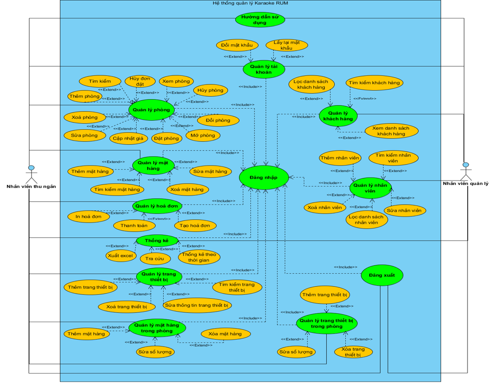

### __2.2 Đặc tả Usecase Mở Phòng:__
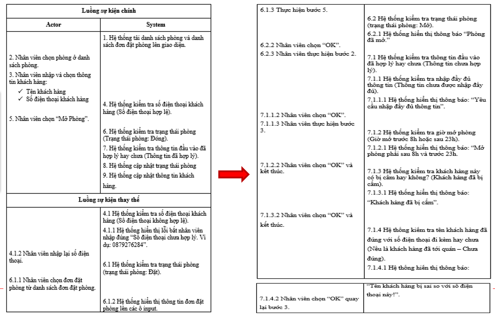

### __2.3 Sơ đồ Activity Mở Phòng:__
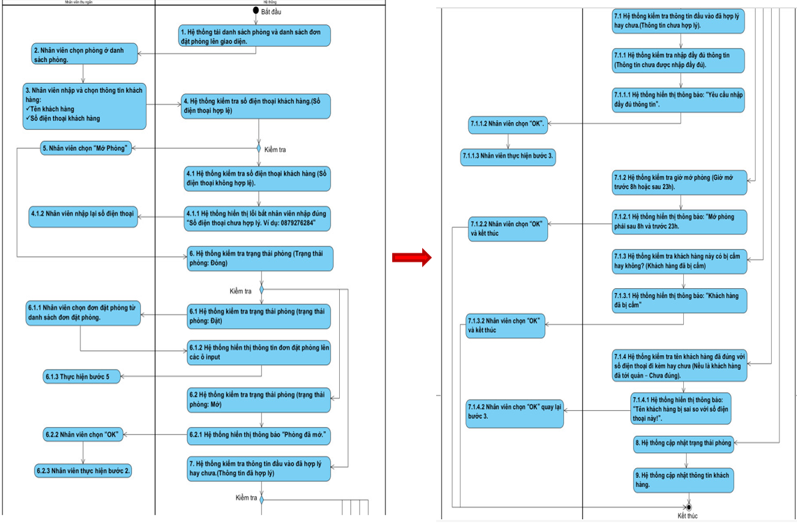

### __2.4 Sơ đồ Sequence Mở Phòng:__
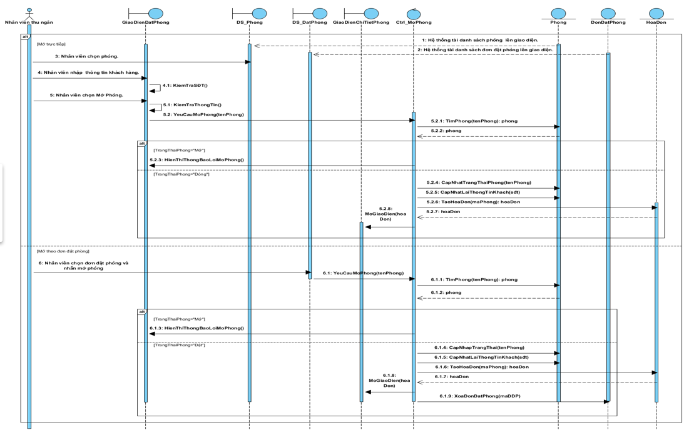

---
## __3. Thiết kế:__
### __3.1 Sơ đồ class:__
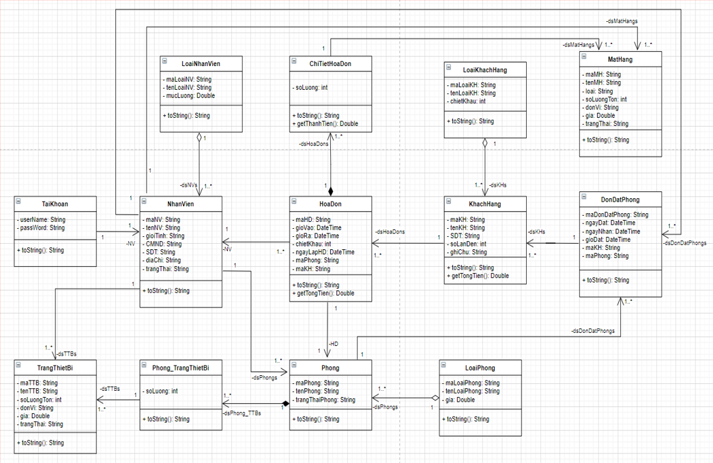

### __3.2 Sơ đồ database:__
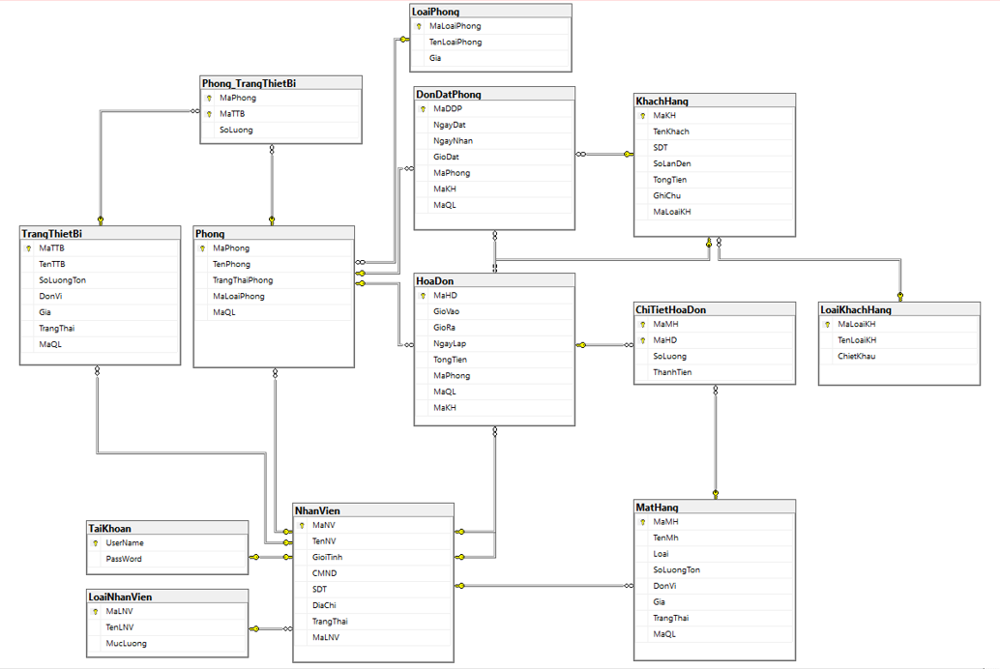

### __3.3 Sơ đồ lường màn hình:__
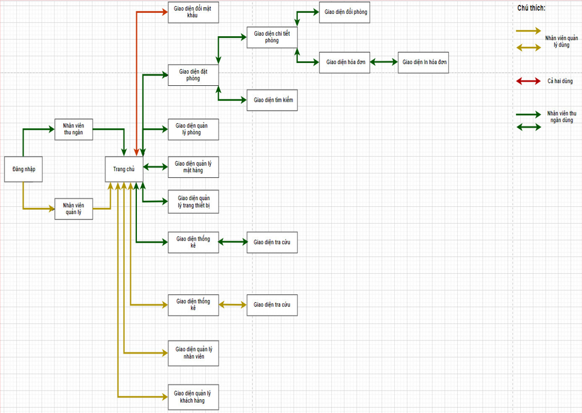

### __3.4 Một số màn hình thiết kế:__
#### __3.4.1 Giao diện quản lý phòng:__
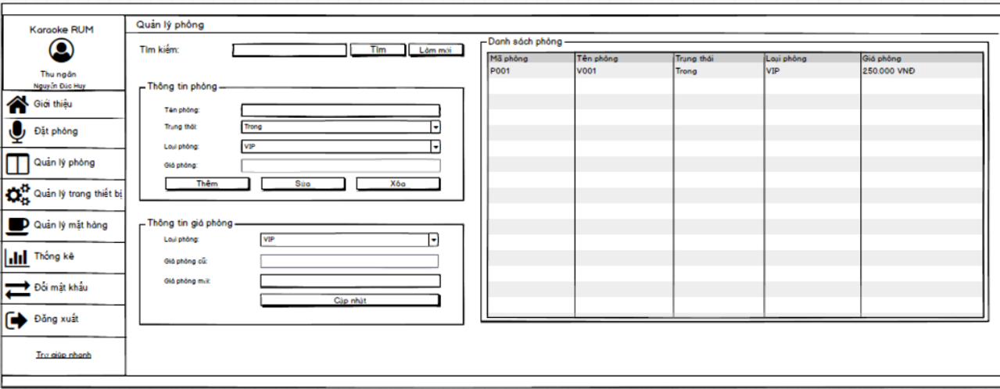

### __3.4.2 Giao diện đặt phòng:__
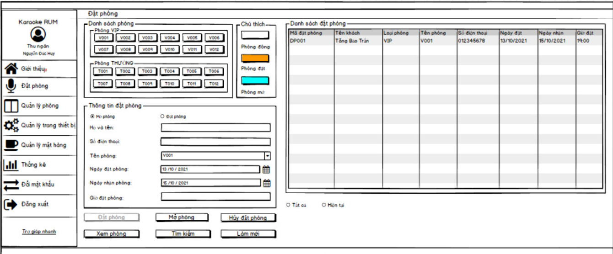

### __3.4.3 Giao diện chi tiết phòng:__
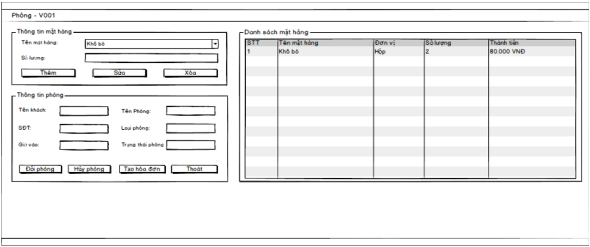

## __4. Công nghệ sử dụng:__
### __4.1 Phần cứng:__
    * CPU intel i5 7th gen.
    * RAM 8GB. 
    * SSD 256GB. 
    * Độ phân giải màn hình: 1920 x 1080.

### __4.2 Phần mềm:__
    * Microsoft visual studio. => Code
    * Microsoft sql server managerment studio 18. => CSDL
    * Balsamiq_Mockups_3.   => Thiết kế giao diện
    * Visual-paradigm.      => Vẽ các sơ đồ phục vụ phân tích

### __4.3 Ngôn ngữ lập trình:__
    * Ngôn ngữ lập trình C#.
    * Ngôn ngữ truy vấn Linq.
    * Ngôn ngữ truy vấn dữ liệu SQL.
    * Framework: .NET

## __5. Hướng phát triển:__
    * Cải thiện tốc độ của ứng dụng.
    * Tích hợp chức năng làm mới vào các chức năng sửa đổi dữ liệu.
    * Phát triển thêm chức năng tính lương nhân viên. 
    * Trong quá trình sử dụng khách hàng có thể đưa ra yêu cầu sửa đổi hoặc mở rộng thêm chức năng,…

